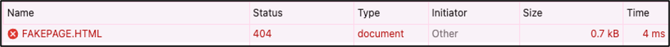
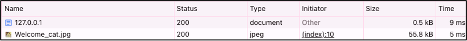
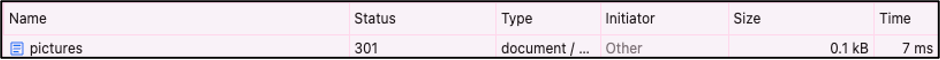
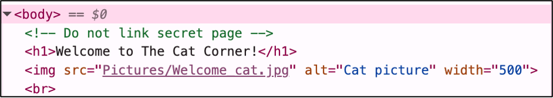
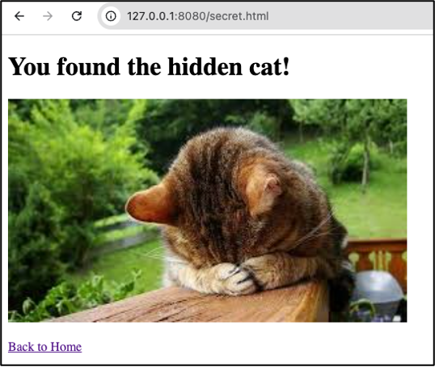
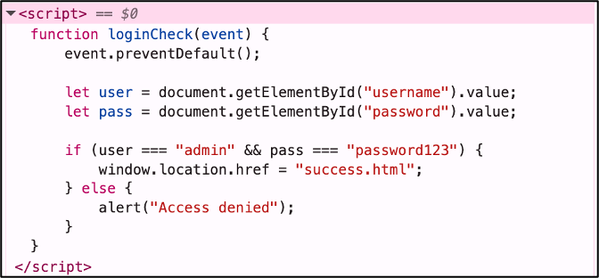
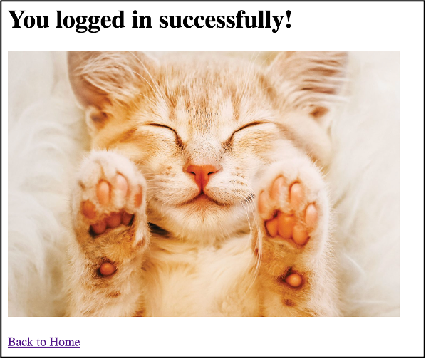
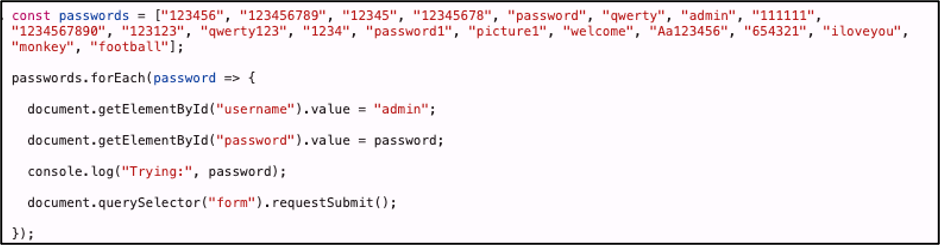
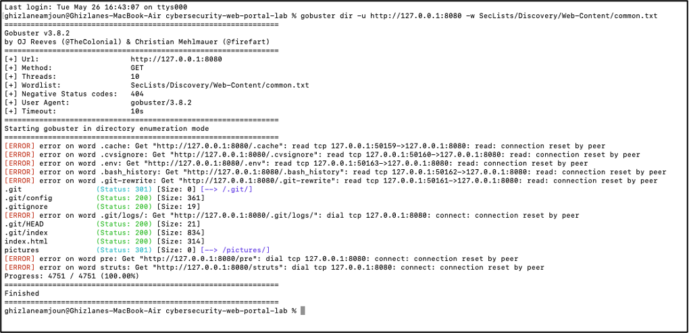

# Cybersecurity Web Portal Lab: Building and Investigating a Vulnerable Website

## Overview

I built and analyzed a small (intentionally vulnerable) web application in a local environment to test its security. The goal was to experience both sides of web security: first as the developer building the application, then as the attacker identifying weaknesses. This project gave me the opportunity to apply and connect some of the concepts I’ve been exploring through my cybersecurity journey, including:

- **Web & Networking:** HTTP request/response, status codes, localhost (127.0.0.1) and port-based hosting, basic web server behavior
- **Frontend Development:** HTML page structure, JavaScript client-side logic, form handling and input validation
- **Security Fundamentals:** CIA triad, OWASP Top 10, CWE’s, authentication weaknesses, sensitive data exposure, attack surface awareness
- **Reconnaissance & Analysis:** Manual source code inspection, browser DevTools, hidden page discovery and enumeration concepts, basic directory brute forcing

## Project Setup

**Technical Details** 

- Application: Static website (“The Cat Corner”)
- Languages: HTML, JavaScript
- Code Editor: Visual Studio Code
- Version Control: Git, GitHub
- Local Hosting: Python HTTP server (python3 -m http.server 8080)
- Accessed via: http://127.0.0.1:8080
  
**Site Structure/Flow**

- Users start at the home page: index.html
- Navigation is provided to a login page: login.html
- Successful login redirects to a “success” page: success.html
- Hidden page (secret.html) exists outside the normal navigation flow
  
## Security Investigation

After building the site, I shifted into an attacker mindset and analyzed it for common vulnerabilities.

### Analyzing HTTP Requests

**Procedure**

Using the Browser Developer Tools (Network tab), I inspected the HTTP requests generated while interacting with the site. I disabled browser caching so each request would be fetched directly from the server, allowing me to observe real-time responses instead of cached results. I navigated through different pages, refreshed content, and modified URLs to observe how the server responded under both valid and invalid requests. I also examined the Headers and Response panels to better understand the information exchanged between the browser and server, including response codes, server details, and resource handling.

Through this testing, I observed several common HTTP status codes:

*404 File Not Found: requested resource does not exist*

*200 OK: successful request and response*

*301 Moved Permanently: request is redirected to a different location*

**Findings**

This exercise helped me better understand how the application communicates over HTTP and how information can be gathered during the reconnaissance phase of an assessment. While I did not identify any major vulnerabilities in the HTTP responses themselves, I observed that all pages were directly accessible through their URLs since there was no authentication or access control layer in place. I also noticed that the server exposed basic implementation details through HTTP headers (Python SimpleHTTP server), which could help an attacker identify the technologies being used.
Overall, this demonstrated how HTTP traffic can reveal useful information about an application's structure and technologies, even before deeper security testing begins.

**Recommendations**

For a more secure setup in a real environment:

- Implement authentication and authorization controls for restricted resources
- Reduce unnecessary server information exposed in HTTP headers
- Use a production-ready web server rather than a development server
- Regularly review HTTP responses and headers for information disclosure

### Inspecting the Source Code

**Procedure**

I manually reviewed the frontend source code using the browser "View Page Source" tool to better understand how the application was structured and to see whether any sensitive information was exposed. During this review, I discovered a developer comment in index.html:

_“Do not link secret page”_

This suggested the presence of a hidden page. I tested several common path variations such as /secret, /hidden, and /secret.html, and found that /secret.html returned a publicly accessible page. 

**Findings**

While reviewing the source code, I found information that revealed details about the application's structure. Although the page was hidden from normal navigation, it was still accessible directly through its URL. This demonstrated how information exposed in source code can unintentionally reveal application functionality and how hidden resources can still be discovered even when they are not linked anywhere on the site.I also observed that there were no controls preventing direct access to the page once its location was known.

**Recommendations**

For a more secure setup in a real environment:

- Remove sensitive comments and internal notes before deployment
- Avoid exposing references to hidden or internal resources in frontend code
- Implement authentication and authorization controls for restricted content
- Enforce access restrictions on the server side rather than relying on hidden URLs

### Analyzing Authentication & Password Testing

**Procedure**

I inspected login.html to understand how authentication was implemented in the application. While reviewing the source code, I observed that the login logic was handled entirely in JavaScript and that the credentials were hardcoded directly into the page. Using those credentials, I was able to login successfully.

To further evaluate the login process, I tested the form using a list of common passwords. Since the authentication logic was entirely client-side and there was no backend validation, I used the browser console to automate login attempts.

The script successfully cycled through the password list and repeatedly submitted login attempts without any restrictions.

**Findings**

This testing showed that the authentication process was implemented entirely on the client side, meaning both the authentication logic and credentials were visible to anyone inspecting the source code. I observed that a weak password (password123) was used and that there were no protections against repeated login attempts. The login form accepted continuous submissions without any form of rate limiting, lockout mechanism, or additional verification. Overall, this demonstrated why authentication should not be trusted when implemented solely in frontend code and how exposed credentials can quickly undermine the security of an application.

**Recommendations**

For a more secure setup in a real environment:

- Move authentication logic to the backend
- Store passwords securely using hashing
- Remove hardcoded credentials from frontend code
- Avoid weak or commonly used passwords
- Implement protections against repeated login attempts
- Consider multi-factor authentication for higher-risk systems

### Enumerating Hidden Resources

**Procedure**

To check for accessible hidden resources, I used Gobuster with a SecLists wordlist to scan for common files and directories on the site. The scan returned several accessible paths, including:
/index.html, /pictures/, /.git/, /.git/index, and /.gitignore.

**Findings**

This exercise demonstrated how automated enumeration tools can quickly discover resources that may not be visible through normal browsing. While some of the results were expected, such as index.html and the pictures directory, I was more interested in finding the exposed .git/ directory and related repository files. I observed that repository metadata was publicly accessible, including files such as .git/index and .gitignore. Although this was only a local lab environment, exposed version control files could provide valuable information about an application's structure, development history, and internal files. This testing also showed how an attacker can gather information about an application simply by probing for common files and directories, even when they are not linked anywhere on the site. Overall, this reinforced the importance of reviewing what is publicly accessible before deploying an application, since development artifacts and internal files can unintentionally become part of the attack surface.

**Recommendations**

For a more secure setup in a real environment:

- Block access to .git/ and other version control directories at the server level
- Ensure development and configuration files are not deployed to public directories
- Regularly test applications for exposed files and directories
- Remove unnecessary system, metadata, and repository files before deployment

### Vulnerability Mapping

The findings from the investigation were mapped to their most relevant CWE classifications and aligned with the OWASP Top 10 (2025) to connect implementation-level issues with broader web security risk categories.

**CWE Mappings**

- CWE-425 (Direct Request / Forced Browsing): Hidden pages were accessible directly through their URLs without any access restrictions.
- CWE-615 (Sensitive Information in Source Code Comments): Developer comments exposed internal information about application structure.
- CWE-602 (Client-Side Enforcement of Server-Side Security): Authentication logic was implemented entirely on the client side, allowing it to be bypassed or manipulated.
- CWE-798 (Hard-coded Credentials): Credentials were embedded directly in frontend source code and visible to users.
- CWE-1391 (Use of Weak Credentials): A weak password was used, reducing resistance to basic guessing attempts.
- CWE-307 (Improper Restriction of Excessive Authentication Attempts): No controls were in place to limit repeated login attempts.
- CWE-538 (Exposure of Information Through Externally Accessible File/Directory): Hidden resources were discoverable through automated enumeration techniques.
- CWE-552 (Files or Directories Accessible to External Parties): The .git/ directory and repository files were publicly accessible.
- CWE-497 (Exposure of Sensitive System Information): HTTP responses disclosed underlying server and implementation details.
  
**OWASP Top 10 (2025) Alignment**

These issues primarily map to the following OWASP Top 10 categories:

- A01 – Broken Access Control: Direct access to hidden pages, exposed .git/ directory, and unrestricted resource discovery.
- A06 – Insecure Design: Client-side authentication and hardcoded credentials reflect fundamental design weaknesses.
- A07 – Authentication Failures: Weak credentials and lack of rate limiting or brute-force protections.

### Conclusion

Overall, the application showed how quickly security gaps can appear in even a small, static web system when access control and secure design are not considered from the start. Across different parts of the testing, the main issue wasn’t a single vulnerability, but the combination of exposed resources, client-side logic, and missing protective controls that made internal information easily discoverable. From a CIA triad perspective, the biggest impact is on Confidentiality, since multiple elements of the application (including hidden resources, repository files, credentials, and implementation details) were accessible without any authentication barriers. This effectively removes the separation between public and internal data. Integrity is not directly impacted in this setup since no modifications were made during testing, but the exposed information could realistically be used as a starting point for manipulation or exploitation in a real-world scenario. Availability remained stable throughout testing, with no disruptions or service-level issues observed.

## Unexpected Challenges

During the project, I ran into a few unexpected issues which led to a few practical lessons along the way.

**Login script bug**

While building the login page, I included the event parameter in the loginCheck function without fully understanding its role. During testing, the form wasn’t submitting correctly when clicking the login button. After digging into it, I learned about event.preventDefault(), which stops the default form behaviour so the page doesn’t refresh before the login logic runs. Once added, the login flow worked as expected.

**Committing changes**

At one point, the website stopped working and it was difficult to trace the issue because I had made multiple changes at once without committing in between. Everything was grouped together, which made debugging harder. Eventually, I realized the issue wasn’t in the code itself but related to moving the project folder. Still, it highlighted how important smaller, incremental commits are for tracking changes and isolating problems faster.

**Error: Connection Reset by Peer**

While running Gobuster with a SecLists wordlist, some requests returned a “connection reset by peer” error while others worked normally. After investigating, I learned this usually happens when the server closes the connection unexpectedly. In this case, it was likely due to limitations of the local Python server, which isn’t designed to handle aggressive or unusual automated requests.

## Key Takeaways

Overall, this project helped me connect theory with practical hands-on experience across web development and basic cybersecurity analysis. It gave me a better understanding of how even simple applications can contain multiple weaknesses when security is not considered from the start.

- I learned how HTTP requests and responses work in practice, including status codes and how to interpret them using DevTools
- I gained experience inspecting frontend source code and identifying exposed information such as comments and hidden routes
- I understood how client-side authentication is insecure because it can be viewed and manipulated directly in the browser
- I learned how automated tools like Gobuster are used to discover hidden directories and how to interpret their output
- I saw how exposed version control files (like .git/) can leak sensitive development information
- I learned how small implementation decisions (like missing backend validation) can lead to major security weaknesses
- I improved my understanding of CWE’s, OWASP Top 10 concepts, and the CIA triad and how they apply in real, simple applications
- I learned the importance of using Git properly, especially making smaller commits to track changes and debug issues more easily
- I gained experience troubleshooting unexpected issues, whether from code, server behaviour, or tooling limitations
- I developed a better understanding of how attacker-style thinking can be used to evaluate applications from a security perspective

